# MiniPoller 系统架构文档

## 📌 项目概述

MiniPoller 是一个具有全局文本捕获、实时投票和图表可视化功能的快速投票应用程序。该系统采用了前后端分离的架构，结合 Electron 桌面应用框架，提供跨平台的用户体验。

---

## 🏛️ 整体系统架构

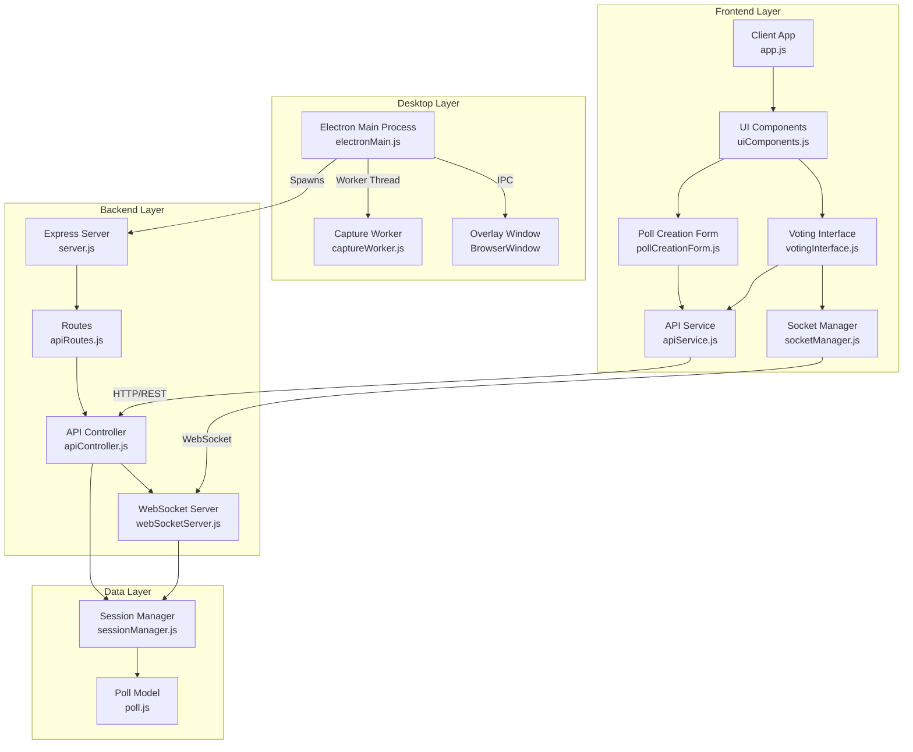

---

## 🔧 后端架构详解

### 后端模块结构

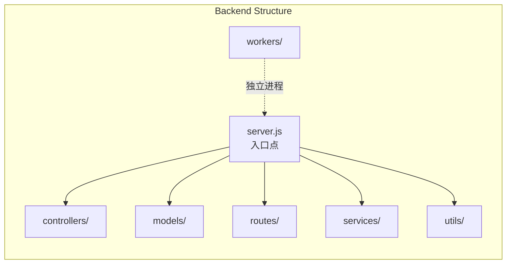

### 类图 - 后端核心类

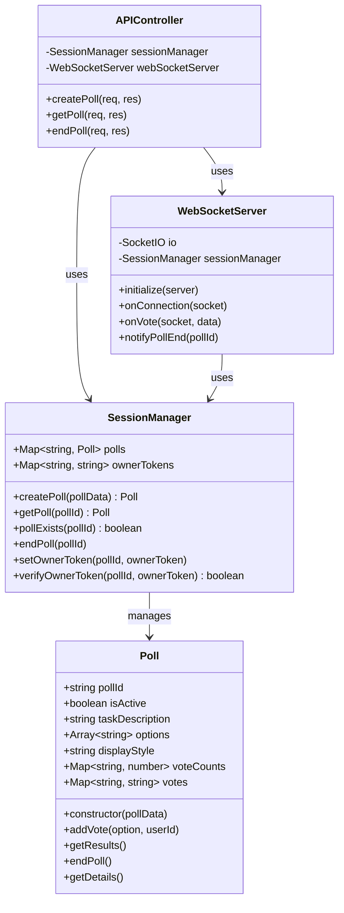

---

## 🖥️ Electron 桌面架构

### Electron 进程模型

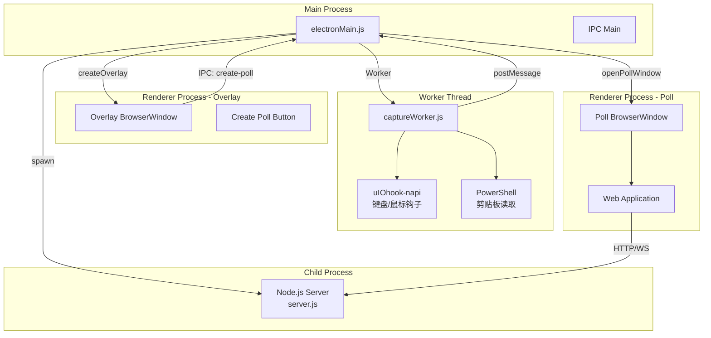

### Electron 事件流程

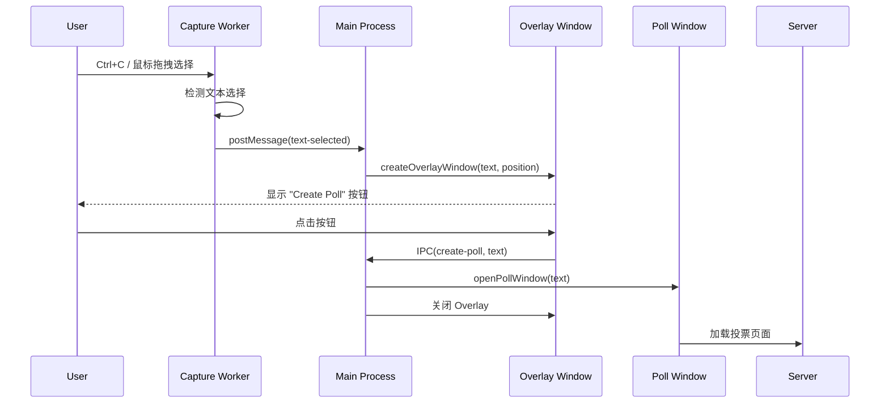

---

## 🌐 前端架构详解

### 前端模块结构

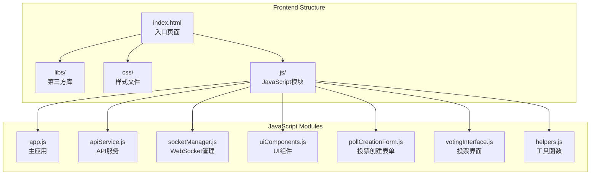

### 类图 - 前端核心类

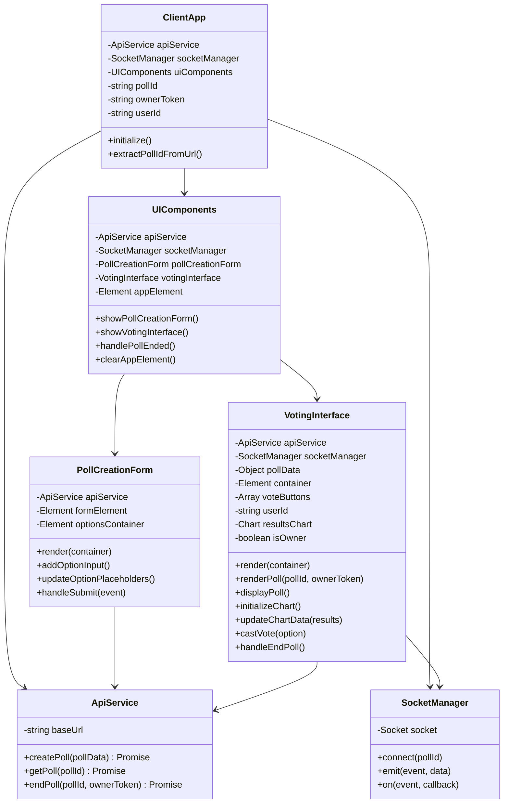

---

## 🔄 数据流与交互

### 投票创建流程

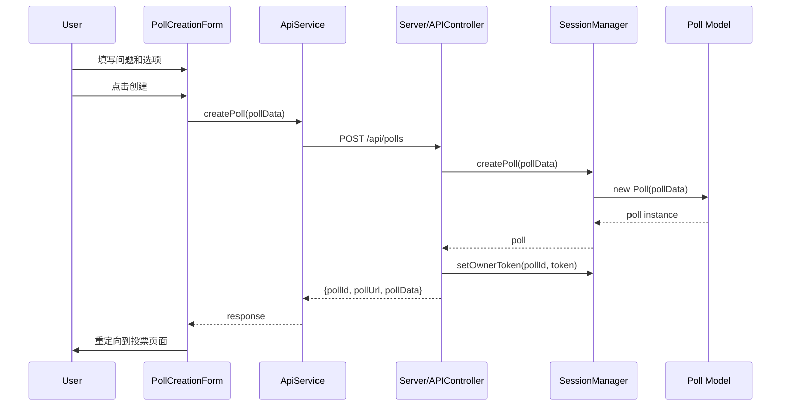

### 实时投票流程

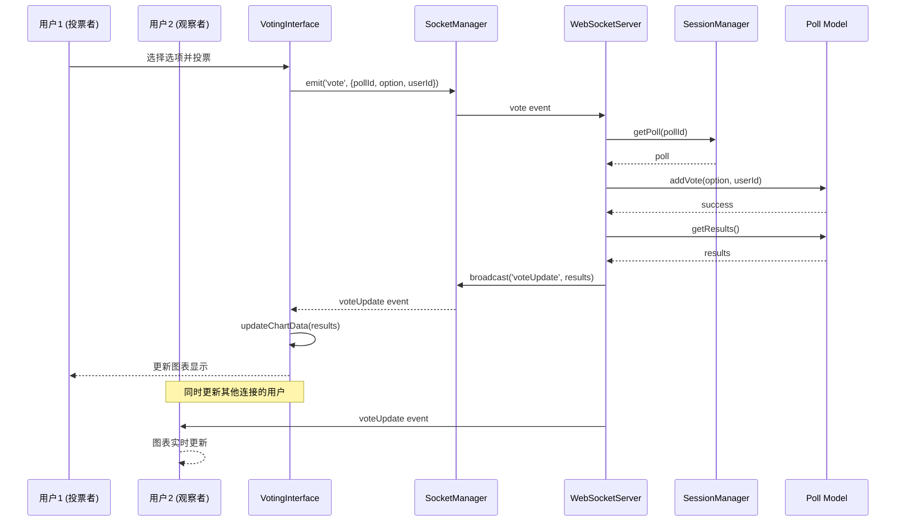

### WebSocket 连接管理

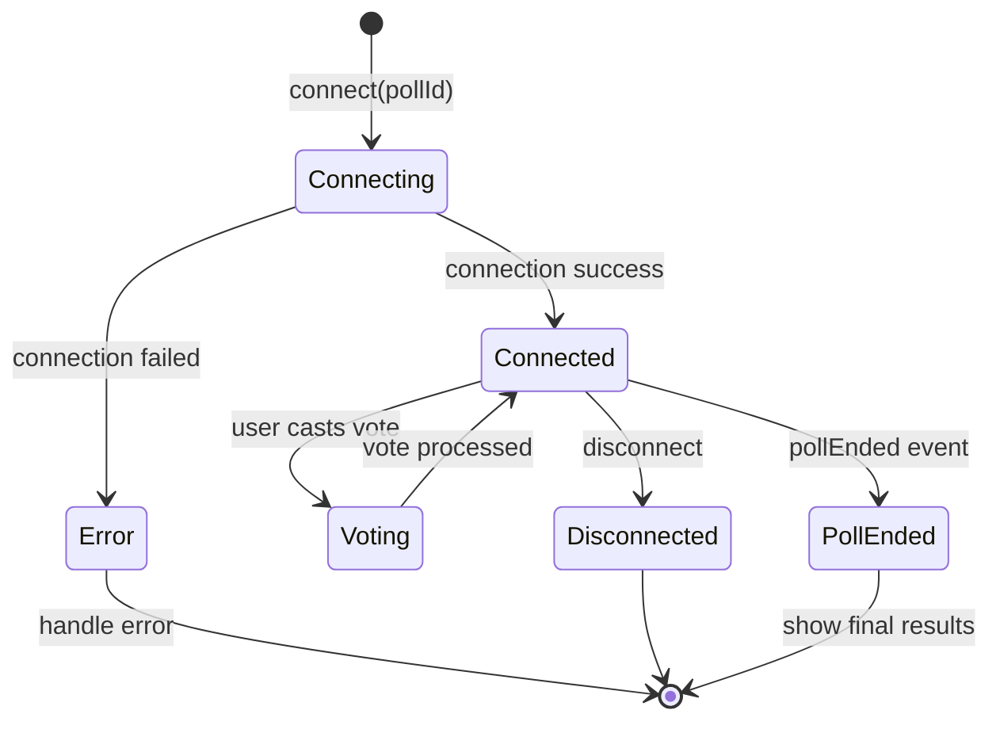

---

## 🏗️ 设计模式分析

### 1. MVC 模式 (Model-View-Controller)

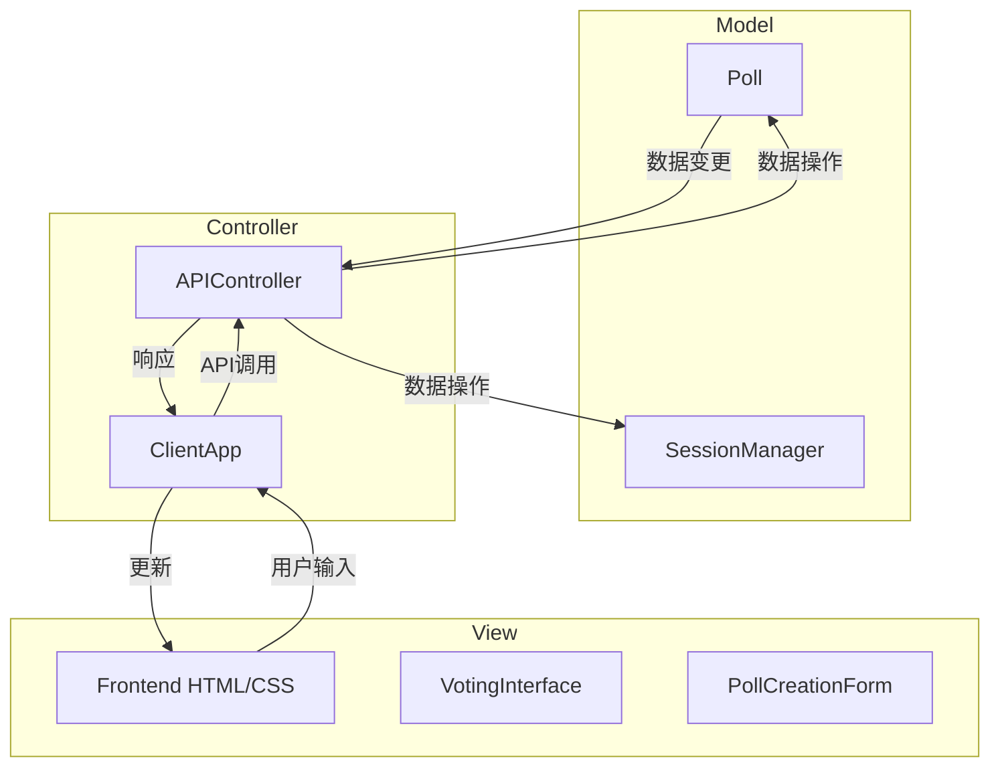

### 2. Observer/Pub-Sub 模式 (WebSocket 实时更新)

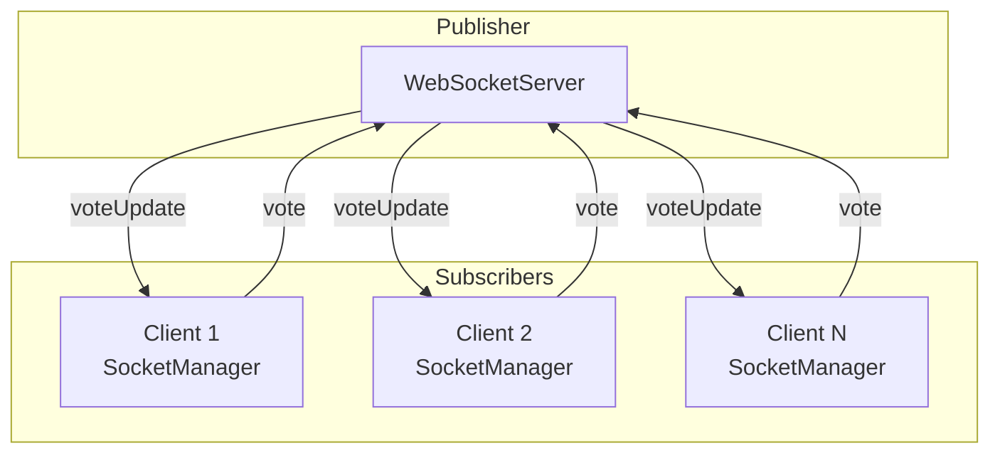

### 3. Facade 模式 (API Service)

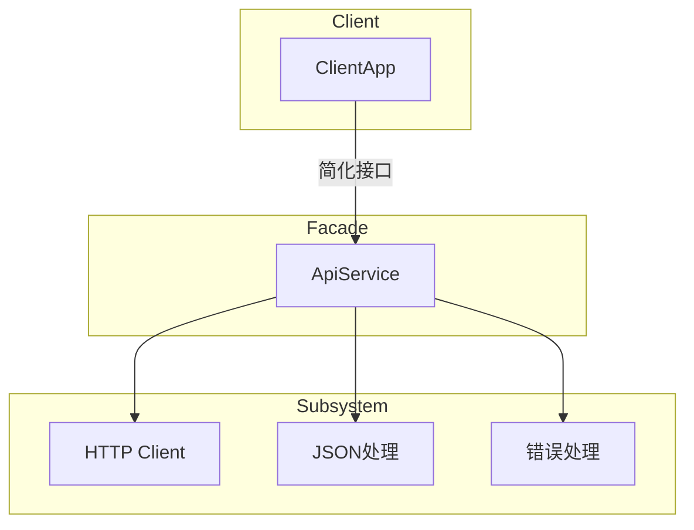

### 4. Factory 模式 (Poll 创建)

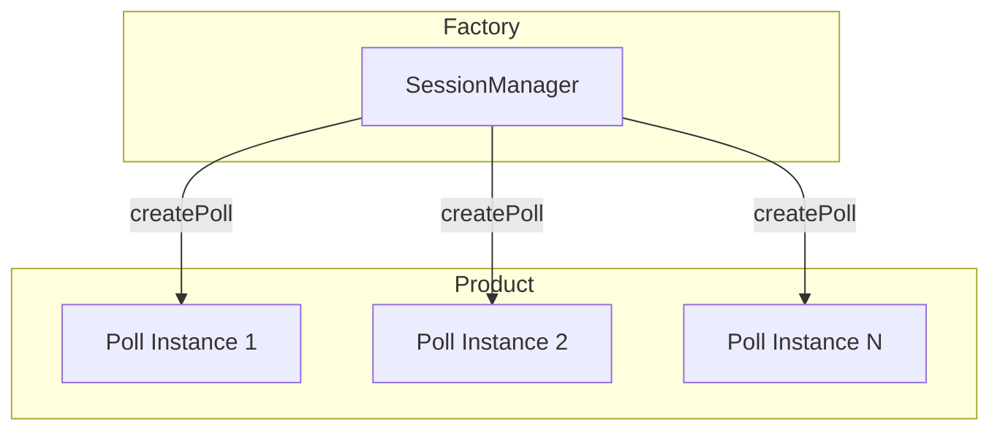

### 5. Singleton 模式 (Session Manager)

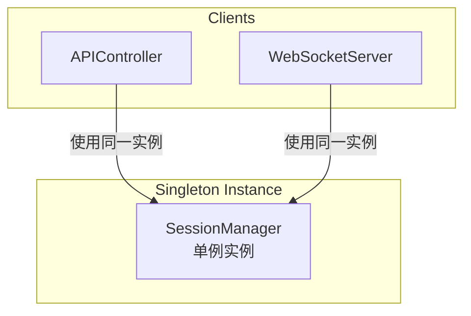

---

## 📁 目录结构

```
MiniPoller/
├── backend/
│   ├── controllers/
│   │   └── apiController.js      # API 控制器
│   ├── models/
│   │   ├── poll.js               # 投票模型
│   │   └── sessionManager.js     # 会话管理器
│   ├── routes/
│   │   └── apiRoutes.js          # API 路由
│   ├── services/
│   │   └── webSocketServer.js    # WebSocket 服务
│   ├── utils/
│   │   └── utilities.js          # 工具函数
│   ├── workers/
│   │   ├── captureWorker.js      # 文本捕获 Worker
│   │   ├── overlayManager.js     # Overlay 管理器
│   │   └── overlayWindow.js      # Overlay 窗口
│   ├── tests/
│   │   └── poll.test.js          # 单元测试
│   ├── electronMain.js           # Electron 主进程
│   ├── server.js                 # Express 服务器
│   └── package.json
├── frontend/
│   ├── css/
│   │   └── style.css             # 样式文件
│   ├── js/
│   │   ├── app.js                # 主应用
│   │   ├── apiService.js         # API 服务
│   │   ├── socketManager.js      # WebSocket 管理
│   │   ├── uiComponents.js       # UI 组件
│   │   ├── pollCreationForm.js   # 投票创建表单
│   │   ├── votingInterface.js    # 投票界面
│   │   └── helpers.js            # 工具函数
│   ├── libs/
│   │   ├── chart.js              # Chart.js 库
│   │   └── socket.io.min.js      # Socket.IO 客户端
│   └── index.html                # 入口页面
├── README.md
├── IMPROVEMENTS_SUMMARY.md
└── ARCHITECTURE.md               # 本文档
```

---

## 🔌 技术栈总结

### 后端技术

| 技术 | 用途 | 版本 |
|------|------|------|
| **Node.js** | 运行时环境 | ≥14.0.0 |
| **Express** | Web 框架 | ^4.21.1 |
| **Socket.IO** | 实时通信 | ^4.8.0 |
| **Electron** | 桌面应用框架 | ^22.3.27 |
| **uiohook-napi** | 全局键盘/鼠标钩子 | ^1.5.4 |
| **UUID** | 唯一标识符生成 | ^10.0.0 |
| **dotenv** | 环境变量管理 | ^16.4.5 |
| **Helmet** | HTTP 安全头 | ^8.0.0 |
| **CORS** | 跨域资源共享 | ^2.8.5 |

### 前端技术

| 技术 | 用途 |
|------|------|
| **HTML5** | 页面结构 |
| **CSS3** | 样式和动画 |
| **JavaScript (ES6+)** | 前端逻辑 |
| **Chart.js** | 数据可视化 |
| **Socket.IO Client** | WebSocket 通信 |

### 开发工具

| 工具 | 用途 |
|------|------|
| **Jest** | 单元测试 |
| **npm** | 包管理器 |

---

## 🎯 系统设计特点

### 优势

1. **实时性**: 使用 WebSocket 实现投票结果的实时更新
2. **跨平台**: Electron 支持 Windows/macOS/Linux
3. **全局捕获**: 支持系统级文本选择捕获（Windows）
4. **模块化**: 清晰的代码分层和模块划分
5. **易扩展**: 基于事件驱动的架构便于扩展功能

### 潜在改进点

1. **持久化存储**: 当前使用内存存储，可考虑添加数据库
2. **身份认证**: 可添加用户认证系统
3. **投票类型**: 可扩展支持多选、排序等投票类型
4. **分布式**: 可考虑支持多节点部署
5. **监控**: 可添加日志和监控系统

---

## 📊 API 接口文档

### REST API

| 方法 | 端点 | 描述 | 请求体 | 响应 |
|------|------|------|--------|------|
| POST | `/api/polls` | 创建投票 | `{taskDescription, options, displayStyle}` | `{pollId, pollUrl, pollData}` |
| GET | `/api/polls/:pollId` | 获取投票详情 | - | `{pollId, taskDescription, options, displayStyle, isActive}` |
| POST | `/api/polls/:pollId/end` | 结束投票 | `{ownerToken}` | `{message}` |

### WebSocket Events

| 事件 | 方向 | 数据 | 描述 |
|------|------|------|------|
| `connection` | Client → Server | `query: {pollId}` | 连接到投票房间 |
| `vote` | Client → Server | `{pollId, option, userId}` | 提交投票 |
| `voteUpdate` | Server → Client | `{pollId, voteCounts, votes, isActive}` | 投票结果更新 |
| `pollEnded` | Server → Client | - | 投票结束通知 |
| `error` | Server → Client | `{message, code, pollId}` | 错误信息 |

---

*文档版本: 1.0*
*最后更新: 2025-11-28*
